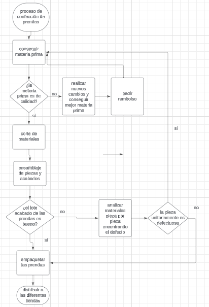

# Confección de prendas

## Principal servicio ofrecido

El principal servicio ofrecido en la confección de prendas es la fabricación de ropa. Este servicio puede incluir una amplia gama de actividades relacionadas con la producción de prendas de vestir, como diseño, corte, costura, acabado y en algunos casos, también el embalaje y la distribución.

Primero,

## Descripción del proceso
Proceso para la confección de prendas:

[Selección de la empresa](SeleccionEmpresa.md)

[Regresar al índice](../README.md)
